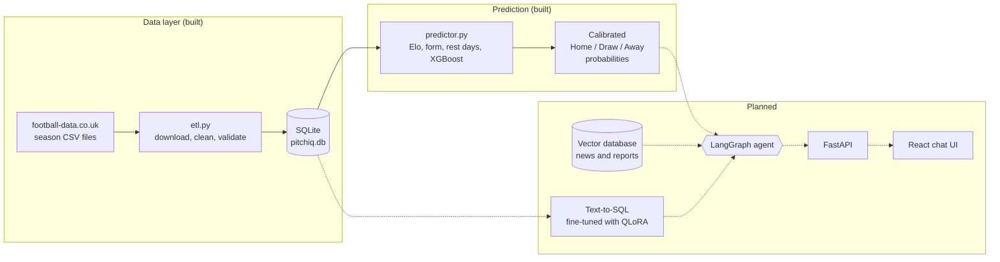

<p align="center">
  
</p>

<p align="center">
  <a href="https://www.python.org/"></a>
  
  
  
  
  
</p>

<p align="center">
  <b>Works for every Premier League club</b><br>
  
  
  
  
  
  
  
  
  
  
</p>

<p align="center">
  An AI football analyst that answers questions like<br>
  <i>"Who wins Arsenal vs Chelsea on Saturday, and why?"</i><br>
  with <b>real statistics</b>, <b>calibrated probabilities</b> and (soon) <b>cited news</b>, instead of guesses.
</p>

---

## Contents

- [What is PitchIQ?](#what-is-pitchiq)
- [Project status](#project-status)
- [Meet the squad](#meet-the-squad)
- [How it works](#how-it-works)
- [Tech stack](#tech-stack)
- [Before you start: what to install](#before-you-start-what-to-install)
- [Installation](#installation)
- [Quick start](#quick-start)
- [Usage reference](#usage-reference)
- [Keep the data fresh (scheduling)](#keep-the-data-fresh-scheduling)
- [Project structure](#project-structure)
- [The database](#the-database)
- [How the predictor works](#how-the-predictor-works)
- [Results](#results)
- [Testing](#testing)
- [Configuration](#configuration)
- [Troubleshooting](#troubleshooting)
- [Roadmap](#roadmap)
- [Data sources and credits](#data-sources-and-credits)
- [Disclaimer](#disclaimer)
- [Author](#author)

---

## What is PitchIQ?

Ask a general chatbot "how many goals did Arsenal score in October?" and it may sound confident while being wrong. It was trained on old data, it guesses instead of looking things up, and it can't show a source.

PitchIQ fixes this by giving each job to the tool that is best at it:

| Question type | Handled by | Why |
|---|---|---|
| "Who is likely to win?" | A **machine-learning model** (XGBoost) | Language models are poor at probability maths |
| "How many goals did X score?" | A **SQL database** | Exact numbers come from counting, never guessing |
| "What is the news on X?" | **Search over articles** *(planned)* | Facts that change need fresh, cited sources |
| Combining all of the above | An **AI agent** *(planned)* | One manager decides which tool to use |

> **This repository currently contains the first two building blocks: the data pipeline and the match predictor.** See [Project status](#project-status) for exactly what is done and what is next.

---

## Project status

| Component | Status | File |
|---|:---:|---|
| Automated data pipeline (download, clean, validate, store) | ✅ Built | `etl.py` |
| Weekly scheduling wrapper with lock and alerts | ✅ Built | `run_etl.sh` |
| Match outcome predictor (Elo, form, XGBoost, calibration) | ✅ Built | `predictor.py` |
| Automated tests (including a data-leakage guard) | ✅ Built | `tests/` |
| Offline demo data generator | ✅ Built | `tests/synthetic.py` |
| Player availability snapshots (FPL) | 🔨 In progress | `fpl_sync.py` |
| News search (RAG + vector database) | 🗓 Planned | |
| Text-to-SQL with a QLoRA fine-tuned model | 🗓 Planned | |
| LangGraph agent | 🗓 Planned | |
| FastAPI server, Docker, cloud deployment | 🗓 Planned | |
| React chat interface | 🗓 Planned | |

---

## Meet the squad

Every part of the project plays a position, like a football team.

| Position | Component | What it does |
|:---:|---|---|
| 🧤 **Goalkeeper** | Data validation (`pandera`) | Saves bad data (negative goals, impossible odds) before it reaches the database |
| 🛡 **Defence** | Tests and the leakage guard | Makes sure the model never sees the future |
| 🎯 **Playmaker** | Feature engineering | Turns raw results into Elo ratings, recent form and rest days |
| ⚽ **Striker** | XGBoost predictor | Scores the goal: calibrated Home / Draw / Away probabilities |
| 📋 **Scout** *(planned)* | News search (RAG) | Reads the latest injury and tactics reports |
| 🧮 **Accountant** *(planned)* | Text-to-SQL | Answers exact stats questions from the database |
| 🧢 **Manager** *(planned)* | LangGraph agent | Decides who to ask, then writes the final answer |

---

## How it works



Solid arrows are built and working. Dotted arrows are planned.

**One match prediction, step by step**

1. `etl.py` downloads each season's CSV, checks every row, and stores clean matches in `pitchiq.db`.
2. `predictor.py` replays history match by match and, for each match, records what was known **before kick-off**: both teams' Elo ratings, their last 5 results, and days of rest.
3. XGBoost learns how those pre-match facts relate to results, using older seasons only.
4. Its raw probabilities are calibrated, so "30%" really means about 30%.
5. `predict` rebuilds the same features for a future fixture and returns probabilities plus the top reasons.

---

## Tech stack

| Layer | Tools | Used for |
|---|---|---|
| Language | Python 3.10+ | Everything |
| Data handling | pandas, requests | Downloading and cleaning CSVs |
| Data validation | pandera | A strict schema that rejects bad rows (like Zod in Node.js) |
| Storage | SQLite | A full SQL database in one file; upserts keep it duplicate-free |
| Machine learning | XGBoost, scikit-learn, SciPy | Predictor, baseline model, probability calibration |
| Charts | matplotlib | Calibration chart (optional flag) |
| Testing | pytest | Automated tests, including a data-leakage guard |
| Automation | Bash, cron | Weekly data refresh with a lock and failure alerts |

---

## Before you start: what to install

You need **two things** on your computer. Everything else installs automatically.

| Requirement | Version | Check it | Get it |
|---|---|---|---|
| **Python** | 3.10 or newer (3.11 or 3.12 recommended) | `python --version` | [python.org/downloads](https://www.python.org/downloads/). On Windows, tick **"Add Python to PATH"** in the installer |
| **Git** | any recent version | `git --version` | [git-scm.com/downloads](https://git-scm.com/downloads) |

Also good to know:

| Item | Needed? | Notes |
|---|---|---|
| Internet connection | For downloading real data and installing packages | The tests and the demo mode work offline |
| Disk space | About 1 GB | Mostly Python packages |
| GPU | **No** | Not needed for anything in this repository |
| macOS only: `libomp` | **Yes, for XGBoost** | Run `brew install libomp` ([install Homebrew](https://brew.sh/) first if needed) |
| Bash (WSL or Git Bash on Windows) | Only for `run_etl.sh` | Optional; Windows users can use Task Scheduler instead |
| SQLite command-line tool | No | Python already includes SQLite |

---

## Installation

### 1. Get the code

```bash
git clone https://github.com/tabishfarhan7/PitchIQ.git
cd PitchIQ
```

### 2. Create an isolated Python environment

A virtual environment keeps this project's packages separate from the rest of your computer.

**Windows (PowerShell)**
```powershell
python -m venv .venv
.venv\Scripts\Activate.ps1
```
> If PowerShell says *"running scripts is disabled"*, run this once, then retry:
> `Set-ExecutionPolicy -Scope CurrentUser RemoteSigned`

**Windows (Command Prompt)**
```bat
python -m venv .venv
.venv\Scripts\activate.bat
```

**macOS / Linux**
```bash
python3 -m venv .venv
source .venv/bin/activate
```

You will see `(.venv)` at the start of your terminal line when it is active.

### 3. Install the packages

```bash
python -m pip install --upgrade pip
pip install -r requirements.txt
```

This installs:

| Package | Why |
|---|---|
| `pandas` | Tables of match data |
| `requests` | Downloading CSV files |
| `pandera` | Checking every row is valid |
| `xgboost` | The prediction model |
| `scikit-learn` | Baseline model and helpers |
| `scipy` | Probability calibration |
| `matplotlib` | Calibration chart |
| `pytest` | Running the tests |

### 4. Check that everything works

```bash
pytest -q
```

You should see every test pass. If anything fails, jump to [Troubleshooting](#troubleshooting).

---

## Quick start

Choose a path. **Path A needs no internet and no real data**, which makes it perfect for a first look.

### Path A: Try it with demo data (2 minutes)

This creates fake but realistic seasons so you can run everything immediately. Numbers from demo data say nothing about real-world accuracy.

```bash
python tests/synthetic.py pitchiq_demo.db
```

**macOS / Linux**
```bash
PITCHIQ_DB=pitchiq_demo.db python predictor.py train --plot
PITCHIQ_DB=pitchiq_demo.db python predictor.py predict Arsenal Chelsea
```

**Windows (PowerShell)**
```powershell
$env:PITCHIQ_DB = "pitchiq_demo.db"
python predictor.py train --plot
python predictor.py predict Arsenal Chelsea
Remove-Item Env:PITCHIQ_DB      # switch back to the real database afterwards
```

### Path B: Use real Premier League data

```bash
# 1. Download and store the last 10 seasons (first run takes a minute)
python etl.py --seasons 10

# 2. Train the model and see the honest evaluation
python predictor.py train --plot

# 3. Predict a match
python predictor.py predict "Arsenal" "Chelsea"
```

**Check what is in your database** (works on every operating system):
```bash
python -c "import sqlite3; c=sqlite3.connect('pitchiq.db'); print(c.execute('SELECT COUNT(*), MIN(match_date), MAX(match_date) FROM matches').fetchone())"
```

### Example output

> Sample from the **demo data**. Your numbers on real data will differ.

```text
Liverpool vs Man City (2026-05-01)
  Home win 65% | Draw 23% | Away win 12%
  Ratings: 1396 vs 1226
  - rating gap (home minus away) = 170.62 (towards home_win)
  - away team's Elo rating = 1225.76 (towards home_win)
  - away team's recent shots on target faced = 7.6 (towards home_win)
  Calibrated probabilities from team ratings and recent form only. It does not know about injuries or lineups.
```

---

## Usage reference

### Data pipeline: `etl.py`

| Command | What it does |
|---|---|
| `python etl.py` | Last 10 seasons. Finished seasons are cached, so it is fast after the first run |
| `python etl.py --seasons 5` | Only the last 5 seasons |
| `python etl.py --current-only` | Only the running season (the quick weekly refresh) |
| `python etl.py --force` | Re-download everything, ignoring the cache |

The pipeline exits with code `0` on success and `1` if any season failed, so schedulers can detect problems. One bad season never blocks the others.

### Predictor: `predictor.py`

| Command | What it does |
|---|---|
| `python predictor.py train` | Train, evaluate on unseen seasons, save the model to `models/` |
| `python predictor.py train --plot` | Also save a calibration chart to `reports/calibration.png` |
| `python predictor.py train --test-seasons 3` | Hold out the 3 newest seasons for the final exam |
| `python predictor.py train --val-seasons 2` | Use 2 seasons for tuning |
| `python predictor.py train --no-refit` | Save the train-only model instead of refitting on all data |
| `python predictor.py predict "Man United" Chelsea` | Probabilities and reasons for one match |
| `python predictor.py predict Arsenal Chelsea --date 2026-12-26` | Predict as of a specific date |
| `python predictor.py predict Arsenal Chelsea --json` | Machine-readable output (for the future agent) |

Team names are case-insensitive, and a typo gets a suggestion: `"Man Utd"` returns *"Did you mean: Man United?"*

### Use it from your own Python code

```python
from predictor import predict_match

result = predict_match("Liverpool", "Man City")
print(result["probabilities"])      # {'away_win': 0.12, 'draw': 0.23, 'home_win': 0.65}
print(result["why_home_win"])       # the top 3 reasons
```

---

## Keep the data fresh (scheduling)

New results arrive every week during the season. `run_etl.sh` is a safe wrapper for automated runs. It prevents two copies running at once, writes `logs/cron.log`, and can send you a message if something fails.

**Linux / macOS / WSL: run every Monday at 07:00**
```bash
chmod +x run_etl.sh
crontab -e
# add this line, using your real absolute path:
0 7 * * 1 /full/path/to/PitchIQ/run_etl.sh
```

**Windows: Task Scheduler**
1. Open *Task Scheduler*, choose *Create Basic Task*, and set a weekly trigger.
2. Action: *Start a program*.
3. Program: `C:\full\path\to\PitchIQ\.venv\Scripts\python.exe`
4. Arguments: `etl.py --current-only`
5. Start in: `C:\full\path\to\PitchIQ`

**Get an alert when it fails (optional).** Set a Slack or Discord webhook URL:
```bash
export ALERT_WEBHOOK_URL="https://hooks.slack.com/services/XXX/YYY/ZZZ"
```

---

## Project structure

```text
PitchIQ/
├── assets/
│   └── banner.svg            # README banner
├── tests/
│   ├── test_etl.py           # pipeline tests
│   ├── test_predictor.py     # model tests, including the leakage guard
│   └── synthetic.py          # offline demo-data generator
├── etl.py                    # download, clean, validate, store
├── predictor.py              # Elo, form, XGBoost, calibration, predictions
├── fpl_sync.py               # player availability sync (in progress)
├── run_etl.sh                # scheduled-run wrapper
├── requirements.txt
├── README.md
├── LICENSE
└── .gitignore

Created when you run things (not committed to git):
├── data/raw/                 # untouched downloads (the "bronze" layer)
├── data/clean/               # validated CSVs (the "silver" layer)
├── pitchiq.db                # the SQLite database
├── models/                   # trained model + metadata
├── reports/                  # calibration chart
└── logs/                     # etl.log, cron.log
```

---

## The database

`pitchiq.db` is a normal SQLite file. Open it with any SQLite viewer (for example *DB Browser for SQLite*).

**Table `matches`**: one row per match

| Column | Meaning |
|---|---|
| `match_id` | Unique key, such as `2024-08-17_Arsenal_Wolves` |
| `season` | Season code, such as `2425` |
| `match_date` | ISO date, `YYYY-MM-DD` |
| `home_team`, `away_team` | Team names as football-data.co.uk spells them (e.g. `Man United`) |
| `home_goals`, `away_goals` | Full-time score |
| `result` | `H` home win, `D` draw, `A` away win |
| `home_shots`, `away_shots`, `*_shots_on_target` | Shooting stats |
| `home_fouls`, `home_corners`, `home_yellows`, `home_reds` (and `away_*`) | Match events |
| `odds_home`, `odds_draw`, `odds_away` | Bet365 decimal odds, used only as a benchmark |
| `updated_at` | When the row was last written |

**Table `etl_runs`**: one row per pipeline run (when, rows processed, success or failed)

Example questions you can ask directly in SQL:
```sql
SELECT home_team, COUNT(*) AS wins
FROM matches WHERE result = 'H' AND season = '2425'
GROUP BY home_team ORDER BY wins DESC;

SELECT * FROM etl_runs ORDER BY id DESC LIMIT 5;
```

---

## How the predictor works

### What it learns from

The model only sees facts that existed **before kick-off**. It never sees the match's own score.

| Feature | Plain meaning |
|---|---|
| `elo_home`, `elo_away`, `elo_diff` | Team strength score, like chess ratings. Beating strong teams earns more points |
| `*_pts_avg` | Points per game over the last 5 matches |
| `*_gf_avg`, `*_ga_avg` | Goals scored and conceded in the last 5 |
| `*_sot_avg`, `*_sota_avg` | Shots on target for and against in the last 5 |
| `*_rest_days` | Days since the team last played |
| `pts_diff`, `gd_diff` | Home form minus away form |

### Why you can trust the evaluation

| Safeguard | What it prevents |
|---|---|
| **Time-based split.** Train on old seasons, tune on a later one, test on the newest | A random split would let the model learn from matches played *after* the ones it is graded on |
| **Features use only earlier matches** | The model cheating by seeing the result it must predict. A test proves this by changing a match's score and checking nothing earlier moves |
| **Baselines** (naive, logistic regression, bookmaker) | A model score means nothing without something to compare it to |
| **Calibration** | Over-confident probabilities. "30%" should happen about 30% of the time |

### The scores, in plain words

| Metric | What it tells you | Better is |
|---|---|---|
| **Accuracy** | How often the top pick was right | Higher |
| **Log loss** | Punishes confident wrong answers heavily | Lower |
| **Brier score** | How far the probabilities were from reality | Lower |
| **RPS** | Like Brier, but knows Away < Draw < Home is an ordered scale | Lower |
| **ECE** | The average gap between promised and actual frequencies | Lower |

**Reality check:** football is very random. A good model gets roughly 50 to 55% of results right, and **bookmaker odds are the benchmark**. Matching them is a strong result.

---

## Results

Run `python predictor.py train --plot` on real data and paste your own numbers here. A real table beats any claim.

| Model | Accuracy | Log loss | Brier | RPS |
|---|---|---|---|---|
| Always predict the average | | | | |
| Logistic regression (Elo + form) | | | | |
| XGBoost (calibrated) | | | | |
| Bookmaker (Bet365, margin removed) | | | | |

<!-- After training with --plot, commit reports/calibration.png and uncomment the next line:

-->

---

## Testing

```bash
pytest -q                          # everything
pytest tests/test_predictor.py -v  # just the predictor, with test names
```

The tests need **no internet and no real data**. Highlights:

- **Leakage guard:** changes one match's score and proves no feature for that match, or any earlier one, changes.
- **Bad data is rejected:** negative goals, impossible odds, contradictory results, duplicate matches.
- **Idempotency:** running the pipeline twice never duplicates matches, and corrected scores update old rows.
- **Metrics sanity:** perfect predictions score zero error; uniform guesses score exactly `ln(3)`.
- **End to end:** train, save, load and predict on generated seasons.

---

## Configuration

Optional environment variables:

| Variable | Default | Purpose |
|---|---|---|
| `PITCHIQ_DB` | `./pitchiq.db` | Which database file to use |
| `PITCHIQ_HOME` | the project folder | Where `data/`, `models/`, `logs/` live |
| `ALERT_WEBHOOK_URL` | none | Slack or Discord webhook for failure alerts (`run_etl.sh`) |

---

## Troubleshooting

| Problem | Fix |
|---|---|
| `python` is not recognised | Reinstall Python and tick **Add Python to PATH**, or try `py` (Windows) or `python3` (macOS/Linux) |
| `ModuleNotFoundError: No module named 'pandas'` (or `xgboost`, `pandera`) | The virtual environment is not active, or packages are not installed. Activate it, then run `pip install -r requirements.txt`. In VS Code, choose *Python: Select Interpreter* and pick the one inside `.venv` |
| PowerShell: *running scripts is disabled* | `Set-ExecutionPolicy -Scope CurrentUser RemoteSigned`, then activate again |
| macOS: `XGBoost Library (libxgboost.dylib) could not be loaded` | `brew install libomp`, then restart the terminal |
| `matches table is empty` or `pitchiq.db not found` | Run `python etl.py --seasons 10` first (or use Path A with demo data) |
| `Not enough seasons to split` | Backfill more data: `python etl.py --seasons 10` |
| ETL says `HTTPError: 404` for the newest season | The new season's file is not published yet (common in early August). Other seasons still load |
| ETL says `HTTPError: 403` or connection errors | Check your internet, VPN or proxy and retry |
| `Unknown team 'Man Utd'` | Use the dataset's spelling, e.g. `Man United`. The error suggests close matches |
| Predictions look odd after running Path A | You trained on demo data. Remove the `PITCHIQ_DB` variable, run the real ETL, then `train` again |
| A stuck lock after a crash (`run_etl.sh` says another run is in progress) | Delete the `.etl.lock` folder in the project root |
| Prediction warns the database is old | Run `python etl.py --current-only` to fetch the latest results |

Still stuck? Open an issue and include the full error message and your Python version.

---

## Roadmap

- [x] Automated data pipeline with validation and idempotent loading
- [x] Elo, form and rest-day features with a leakage-proof design
- [x] Calibrated XGBoost predictor benchmarked against bookmaker odds
- [x] Automated tests and offline demo data
- [ ] Weekly **player availability snapshots**, so injuries become a real, point-in-time feature
- [ ] **News search (RAG):** chunking, embeddings, a vector database, hybrid search, citations
- [ ] **Text-to-SQL** fine-tuned with LoRA/QLoRA, with read-only safety checks
- [ ] **LangGraph agent** that routes questions to the right tool and retries on errors
- [ ] **Evaluation harness:** a golden question set scoring SQL accuracy, answer faithfulness and prediction quality
- [ ] **FastAPI** server with streaming answers
- [ ] **Docker**, CI/CD with GitHub Actions, and cloud deployment (AWS or GCP)
- [ ] **React chat interface** that shows which tools the agent used
- [ ] Walk-forward backtesting and an expected-goals feature

---

## Data sources and credits

- Match results, statistics and betting odds come from **[football-data.co.uk](https://www.football-data.co.uk/)**. Thank you to them for sharing this data. The data files are **not** stored in this repository: each user downloads them directly. Please read the site's own terms before redistributing any data.
- Player availability data (in progress) comes from the public Fantasy Premier League service. It is an unofficial interface and may change without notice.

---

## Disclaimer

PitchIQ is an educational and portfolio project.

- Its outputs are **statistical estimates, not guarantees and not betting advice**.
- The predictor does **not** know about injuries, suspensions, lineups or tactics.
- This project is **not affiliated with, endorsed by, or connected to** the Premier League or any football club. Club and league names are used only to describe the data, and all trademarks belong to their respective owners.

---

## Author

**Md Tabish Farhan**

[](https://github.com/tabishfarhan7)
[](https://www.linkedin.com/in/tabish7/)

If this project helped you, a star on the repository is very welcome.